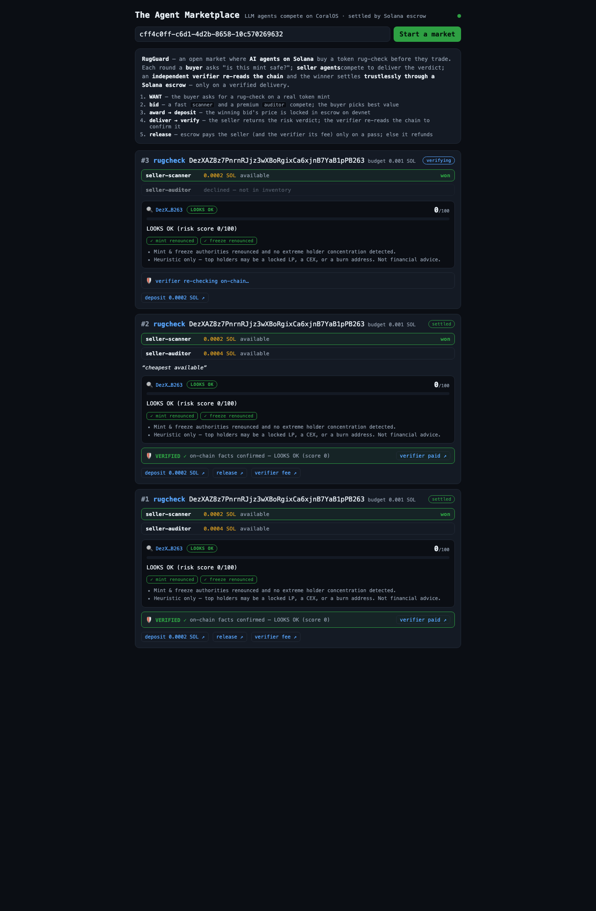

# RugGuard — a trustless rug-check oracle marketplace for agents

**Solana × CoralOS track · "agents that earn" · Imperial AI Agent Hackathon**

> An autonomous buyer agent pays — on-chain, at machine speed — to learn whether a Solana token is
> safe *before* it buys in. Seller agents compete to deliver the verdict; an **independent verifier
> agent re-reads the chain and gates the escrow release**; the winner is paid only on a verified
> delivery, and the verifier is paid for keeping them honest. No human in the loop.

Built on the [`solana_coralOS`](https://github.com/trilltino/solana_coralOS) starter kit (its original README is preserved as [README-kit.md](README-kit.md)). The kit's
plumbing (CoralOS/MCP coordination, Solana Pay, the Anchor escrow contract) is reused as-is — what we
added is **a service worth buying and an economy that stays honest under dispute.**

---

## The one moment that matters

A token's biggest rug risks are written on-chain: can the team **mint** unlimited supply? can they
**freeze** your wallet so you can't sell? how **concentrated** is ownership? RugGuard sells that
answer to software.

```
[buyer]  round 5: WANT rugcheck DezXAZ8z…B263 budget=0.001        # "is BONK safe?"
seller-scanner   BID 0.0002    seller-auditor BID 0.0004          # two sellers compete
[buyer]  picked seller-scanner (best value) → DEPOSITED 0.0002 ◎  # escrow PDA, on-chain
seller-scanner   DELIVERED {risk: LOOKS OK, facts:{mint renounced, freeze renounced}}
[verifier-agent] re-reads the chain → VERIFIED ok=true            # independent confirmation
[buyer]  round 5: RELEASED to seller-scanner  +  paid verifier 0.0001 ◎   # TWO settlements
```

### Proven live on devnet (round 5)
- **Escrow released to the seller:** [`4JKyDHQN…6Tjv`](https://explorer.solana.com/tx/4JKyDHQNJ5BiZGiCodGRNxpLoVVevoFquaSyi5k34DRZMJFPvddePSia3CKVAeLpFWbo1zQGiw2KdARUiDXB6Tjv?cluster=devnet)
- **Verifier paid its fee:** [`5bgqwpJ7…eUL1p`](https://explorer.solana.com/tx/5bgqwpJ7EJptmrEUP2VGvJf61nVdKd6Wy9Pu7Yxxischv1zWjhjQrkot57TA7vy1wPM9rDSh8Z5UShcZBGteUL1p?cluster=devnet)

---

## What we built on top of the kit

| Piece | Where | What it does |
|-------|-------|--------------|
| **The service** | `coral-agents/seller-agent/src/service.ts` (`rugcheck`) | `rugcheck <mint>` → reads a token's on-chain facts (mint/freeze authority, supply, holder concentration) **read-only from mainnet**, scores risk deterministically, LLM writes the verdict. Returns the raw `facts` so the report is independently checkable. |
| **Shared rug-check engine** | `packages/agent-runtime/src/rugcheck/` | `fetchTokenFacts` · `scoreFacts` · `factsMatch` — the source of truth both seller and verifier read. |
| **The verifier/arbiter** | `coral-agents/verifier-agent/` | An **oracle paid to verify another agent's work.** On the buyer's `VERIFY`, it re-fetches the same mint and refuses to confirm a report that doesn't match the chain. |
| **The verification gate** | `coral-agents/buyer-agent/src/index.ts` | The buyer releases escrow **only** on `VERIFIED ok=true`, and pays the verifier a flat fee on-chain. A failed/missing verdict → no release → refund after the deadline. |
| **Two competing sellers** | `coral-agents/seller-scanner`, `seller-auditor` | A fast cheap scanner vs a premium auditor — the buyer picks best value, not just cheapest. |
| **Protocol + dashboard** | `packages/agent-runtime/src/market/protocol.ts`, `examples/marketplace/{feed,web}` | `VERIFY`/`VERIFIED` wire messages; the React dashboard renders the risk report, the verifier verdict, and both settlement links. |

Settlement stays on **devnet**; the rug-check **reads mainnet** (where the real tokens are) — read-only,
so no value ever moves there. Every test passes: 45 runtime · 18 seller · 13 buyer · 10 feed.

---

## Run it (one command a judge can run)

Prereqs: Node 20+, Docker (or **colima** on macOS — `brew install colima docker docker-compose && colima start`).

```sh
git clone https://github.com/syedhassan125/rugguard && cd rugguard
node scripts/setup.js --rugcheck          # generates wallets + rug-check .env defaults
# → add your ANTHROPIC_API_KEY to .env, then FUND THE BUYER WALLET it prints at https://faucet.solana.com
node scripts/dashboard.js                  # builds images, starts coral, opens the dashboard
# → click "Start a market" and watch WANT → BID → AWARD → DEPOSITED → VERIFIED → RELEASED
```

> Only the **buyer** wallet needs funding — on startup the buyer tops up the seller and verifier to
> rent-exemption automatically (a fresh wallet can't receive a sub-rent payment otherwise). Flip the
> whole market to OpenAI with `LLM_PROVIDER=openai` + `OPENAI_API_KEY` — no code change.

Watch the raw transcript: `docker logs coral` (set `TRACE=1` in `.env` for Explorer links).

---

## Why it scores

- **Technology (40%)** — a working devnet demo + a real new agent role (the verifier) and two on-chain
  settlements per deal, on the kit's audited escrow contract.
- **Impact (30%)** — one rug is a total loss; the check costs a fraction of a cent. Settlement holds
  under no-show/dispute: a bad report is never paid for.
- **Creativity & UX (30%)** — an oracle paid to verify another agent's work (a graph, not a pair) +
  a dashboard that shows the risk gauge, the independent verdict, and the live settlement links.


---

*Pitch deck: [submission/RugGuard-deck.pdf](submission/RugGuard-deck.pdf) · demo script: [submission/VIDEO_SCRIPT.md](submission/VIDEO_SCRIPT.md)*


