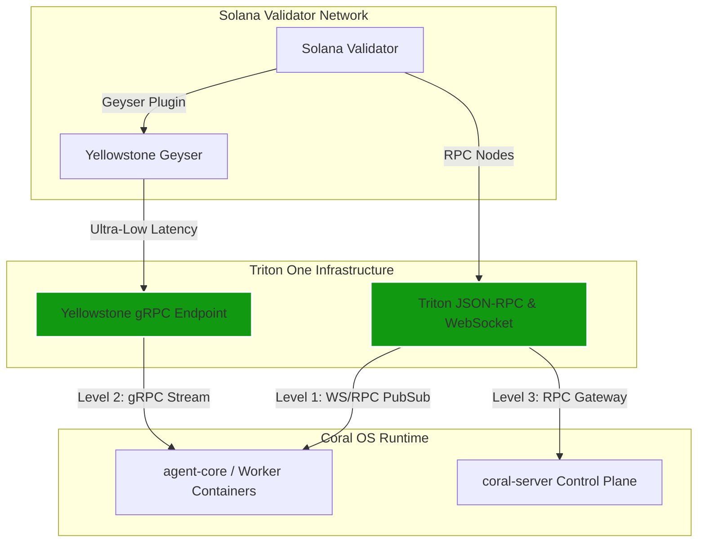

# Triton One & Coral OS: Deep Integration Architecture

This document details how the **Coral OS** control plane operates, what the application does, and how **Triton One** high-performance Solana infrastructure can be integrated at every level of the stack.

---

## 1. How Coral OS Works

"Coral OS" is the runtime and control plane environment designed for running both LLM reasoning agents and deterministic execution workers (e.g., blockchain monitors, transaction signers) in isolated, session-scoped contexts. 

It is divided into three key layers:

```
┌──────────────────────────────────────────────────────────────┐
│  src-ui (React / Frontend App)                               │
│    Renders the dashboard, agent logs, and workflow stages.   │
└───────────────┬──────────────────────────────────────────────┘
                │ Tauri IPC (JSON Webview Bridge)
┌───────────────▼──────────────────────────────────────────────┐
│  src-tauri (Desktop Backend Client)                         │
│    Acts as a proxy, forwarding calls to the control plane.  │
└───────────────┬──────────────────────────────────────────────┘
                │ HTTP / REST Wire Protocol (Bearer Token Auth)
┌───────────────▼──────────────────────────────────────────────┐
│  coral-server (Axum Control Plane)                           │
│    Exposes REST routes for agents, workflows, and messages.   │
└───────────────┬──────────────────────────────────────────────┘
                │ In-Process Rust Calls / Container Orchestration
┌───────────────▼──────────────────────────────────────────────┐
│  agent-core (Rust Library) & Docker Worker Containers        │
│    Orchestrates the active strategies, state, and MCP loops. │
└──────────────────────────────────────────────────────────────┘
```

### The Control Plane Boundary
*   **Decoupled Orchestration:** `agent-core` contains the core domain logic (Message Bus, Shared State versioning, and Agent Manager).
*   **Dual Transports:** The desktop UI can run `agent-core` directly in-process (local mode) or communicate over HTTP with a remote `coral-server` instance.
*   **Containerized Environments:** When agents (such as `helius-monitor` or `user-proxy`) are spawned, `coral-server` runs them in isolated Docker containers, injecting a session-specific **Model Context Protocol (MCP)** connection URL (`CORAL_CONNECTION_URL`). 
*   **The MCP Loop:** Running agents connect back to the server as MCP clients, querying for tools (like `coral_wait_for_mention` or `coral_send_message`) and blocking on them, which creates a highly resilient event-driven architecture.

---

## 2. What This App is Doing

The current application acts as a sandbox for orchestrating Solana agent networks:
1.  **Lifecycle Management:** Creating, starting, stopping, and deleting agents.
2.  **Workflow Orchestration:** Defining step-by-step DAG (Directed Acyclic Graph) workflows, assigning steps to specific agents, and tracking execution states (pending, running, complete, failed).
3.  **Cross-Agent Messaging:** Routing broadcast or direct messages between agents and users via a unified message bus.
4.  **Versioned Shared State:** Providing a version-controlled, auditable key-value store where agents can record their parameters or state transitions.
5.  **Solana Wallet & Transaction Monitoring:** Running worker processes that track wallet balances, monitor signature confirmations, and trigger reactive actions upon receiving funds.

---

## 3. Triton One Integration Levels

Triton One provides dedicated Solana RPC nodes, Yellowstone gRPC (Geyser) streams, and high-frequency network infrastructure. To maximize performance and reliability, Triton One can be integrated at three distinct levels of the Coral OS architecture.

For technical specifications, refer to the [Triton One Documentation](https://docs.triton.one/).



---

### Level 1: Standard RPC & WebSocket Integration (The Consumer Level)
At this level, Triton's high-reliability JSON-RPC and WebSocket PubSub servers replace public default endpoints. This is already supported by the `TritonConfig` struct in [`agent-core/src/triton.rs`](file:///c:/Users/isich/pay/agent_demo/agent-core/src/triton.rs):

```rust
pub struct TritonConfig {
    pub grpc_endpoint: String,
    pub rpc_url: String,
    pub ws_url: String,
    pub x_token: String,
    pub network: String,
}
```

*   **Implementation:** 
    *   Triton uses a Pay-As-You-Go (PAYG) token (`x_token`) embedded directly inside the URLs or passed as a header (e.g. `https://<node>.solana-mainnet.rpcpool.com`).
    *   The agent's subscription threads use Triton's dedicated Websockets (`ws_url`) to watch for transactions and query balances via the JSON-RPC interface (`rpc_url`).
*   **Best Use Cases:** Standard wallet tracking, query balance, checking transaction status, and submitting non-latency-critical transaction signatures.

---

### Level 2: Yellowstone gRPC Integration (The Low-Latency Stream Level)
Public WebSockets struggle with reliability and suffer from head-of-line blocking under heavy network loads. By integrating Triton's **Yellowstone gRPC** (powered by the Geyser plugin framework), agents can consume sub-millisecond, filtered streams of Solana data.

*   **How it Works:** 
    *   Instead of opening multiple WebSocket subscriptions, the agent opens a single HTTP/2 gRPC channel.
    *   The client sends a subscription request containing specific filters (e.g. filter by `accounts`, `transactions` involving a wallet, or `slots`).
    *   Triton streams the serialized Protobuf payloads directly to the agent runtime.
*   **Rust Implementation Blueprint:**
    We can integrate the `yellowstone-grpc-client` crate into `agent-core`:
    ```rust
    use yellowstone_grpc_client::GeyserGrpcClient;
    use yellowstone_grpc_proto::prelude::{subscribe_request_filter_accounts::Filter, *};

    pub async fn stream_wallet_events(config: &TritonConfig, wallet_pubkey: &str) -> anyhow::Result<()> {
        // Authenticate using the Triton PAYG token in the gRPC metadata
        let mut client = GeyserGrpcClient::connect(
            &config.grpc_endpoint,
            Some(config.x_token.clone()),
            None,
        ).await?;

        // Define a filter to track account modifications
        let mut accounts = HashMap::new();
        accounts.insert(
            "wallet_filter".to_string(),
            SubscribeRequestFilterAccounts {
                account: vec![wallet_pubkey.to_string()],
                owner: vec![],
                filters: vec![],
            },
        );

        let (mut sender, mut stream) = client.subscribe_with_dirty_channels().await?;
        sender.send(SubscribeRequest {
            accounts,
            slots: HashMap::new(),
            transactions: HashMap::new(),
            blocks: HashMap::new(),
            blocks_meta: HashMap::new(),
            entry: HashMap::new(),
            commitment: Some(CommitmentLevel::Confirmed as i32),
            ..Default::default()
        }).await?;

        while let Some(message) = stream.next().await {
            if let Ok(UpdateOneof::Account(account_update)) = message?.update_oneof {
                // Instantly emit balance update to the Coral OS Message Bus!
                println!("Account modified: {:?}", account_update);
            }
        }
        Ok(())
    }
    ```
*   **Best Use Cases:** High-frequency arbitrage, real-time MEV-resistant trading, instant payment confirmations, and validator performance monitors.

---

### Level 3: Infrastructure Control Plane Integration (The Orchestrator Level)
At the highest level, the Triton integration is managed dynamically by the control plane (`coral-server`). Endpoints and credentials are dynamically provisioned and injected as part of the container configuration.

1.  **Dynamic Provisioning via REST API:**
    The `coral-server` exposes `/api/v1/agents/:id/triton` to associate a Triton node configuration with a specific agent instance.
2.  **Environment Injection:**
    When spawning a worker Docker container, the orchestrator pulls the Triton configuration from the manager and injects them as environment variables:
    ```bash
    TRITON_RPC_URL="https://my-node.solana-mainnet.rpcpool.com"
    TRITON_WS_URL="wss://my-node.solana-mainnet.rpcpool.com"
    TRITON_GRPC_ENDPOINT="https://api.mainnet.triton.one"
    TRITON_X_TOKEN="my-secret-payg-key"
    ```
3.  **Global Gateway Router:**
    Instead of individual containers managing connection tokens, `coral-server` can run a local **Triton Reverse Proxy**. The proxy intercepts all agent RPC traffic, appends the correct `x-token` header, load-balances requests across multiple Triton backup nodes, and prevents agents from leaking credentials to outer scopes.

---

## 4. Summary of Benefits

Integrating Triton One with Coral OS gives you:
*   **Speed:** Geyser gRPC streams bypass the RPC pool queue entirely, reducing transaction detection latency from 2–5 seconds down to milliseconds.
*   **Security:** Hiding API tokens in the reverse proxy prevents credentials from leaking to LLM code sandboxes.
*   **Reliability:** Triton's dedicated nodes prevent rate-limiting errors (`429 Too Many Requests`) common during network congestion.
